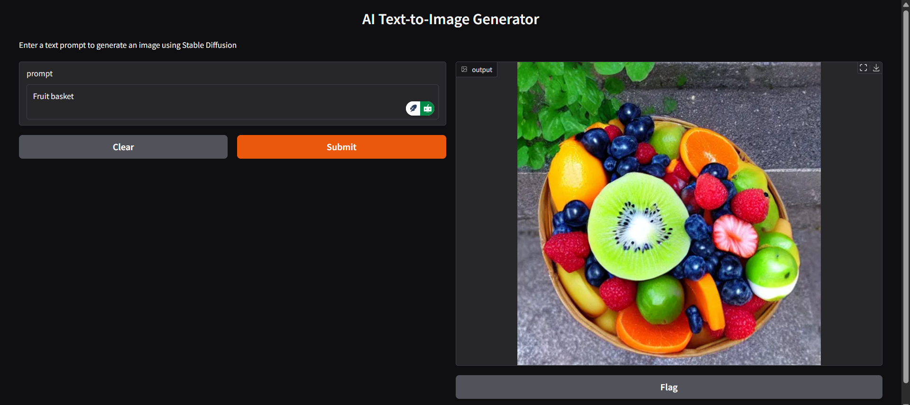
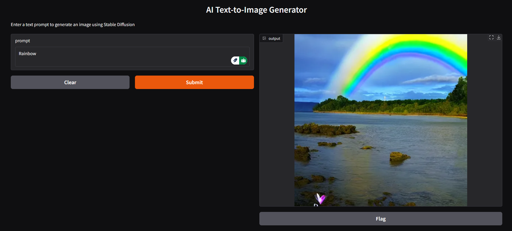
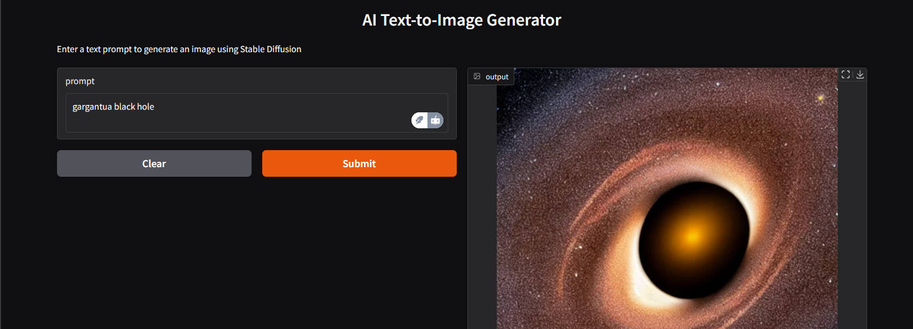

# Stable Diffusion Text-to-Image Generator

A simple web interface for generating images using Stable Diffusion v1.5.

## Features
- Text prompt to image generation
- Responsive Gradio interface

## Setup

1. Clone the repository:
```bash
https://github.com/itz-Prince2022/AI-text-to-image-generator.git
cd text_to_image_generator.ipynb
```


## Results



